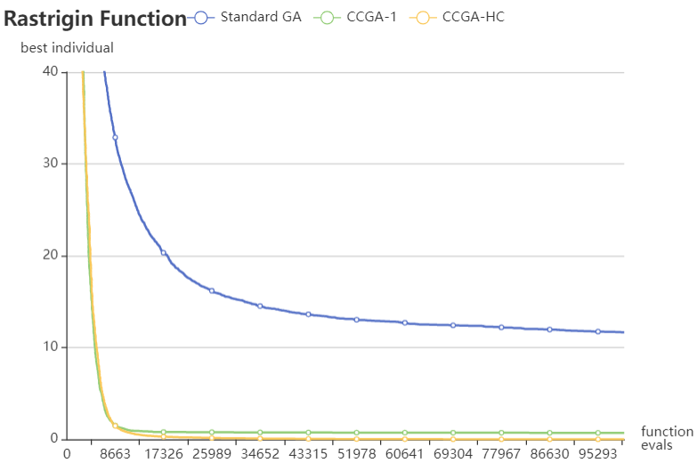
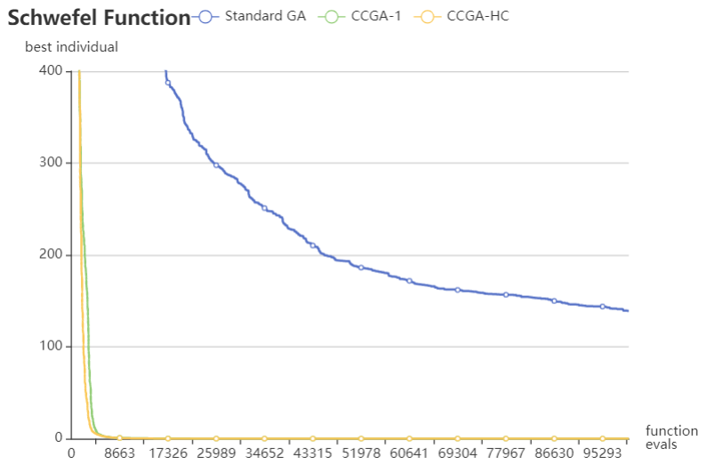
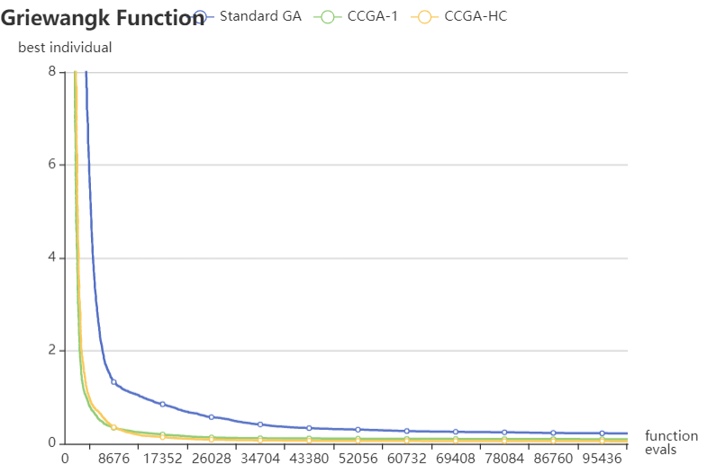
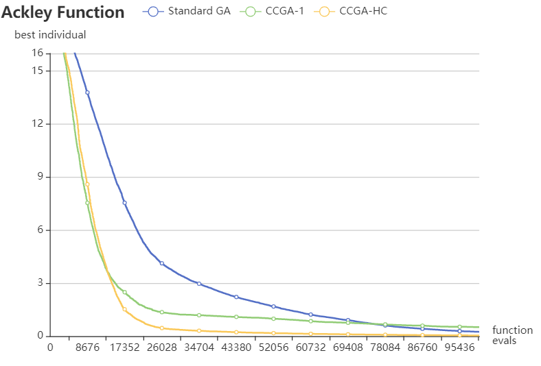

# Assignment 2

This project includes an implementation of [Potter M.A., De Jong K.A. (1994) A cooperative coevolutionary approach to function optimization. In: Davidor Y., Schwefel HP., Männer R. (eds) Parallel Problem Solving from Nature — PPSN III. PPSN 1994. Lecture Notes in Computer Science, vol 866. Springer, Berlin, Heidelberg.](https://link.springer.com/chapter/10.1007/3-540-58484-6_269)

It extends this paper by introducing a variation of the CCGA-1 algorithm called CCGA-HC that performs hill climbing on the elitist selected individuals from each subpopulation every generation.

This extension allows the algorithms to converge on better solutions with lower variance between runs.

| <!-- -->    | <!-- -->    |
| ----------- | ----------- |
|  |  |
|  |        |

## Build

`cd assignment2`

`go build .`

## Run

Check available launch args:

`assignment2.exe --help`

## Unit Tests

`cd assignment2`

`go build .`

`go test ./...`

## Sources

[Roulette Selection Pseudocode](https://stackoverflow.com/a/177278/6008271)

[Two-Point Crossover via Bit Masks Pseudocode](https://stackoverflow.com/a/11705889/6008271)

[Golang Bit Flips](https://stackoverflow.com/a/23192263/6008271)